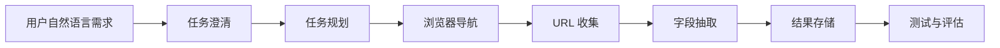

# 系统架构说明

## 总体设计

本项目计划构建一个网页信息采集 Agent。用户通过自然语言描述采集目标，系统将任务拆解为可执行步骤，并通过浏览器自动化工具访问目标页面、识别可采集链接、抽取结构化字段，最终保存结果。

## 核心模块

- 任务澄清：将模糊需求转化为结构化采集任务。
- 任务规划：根据目标页面和采集字段生成执行计划。
- 浏览器导航：使用 Playwright 打开页面并执行筛选、翻页、点击等动作。
- URL 收集：从列表页收集详情页链接。
- 字段抽取：从页面内容中抽取结构化数据。
- 结果存储：将采集结果写入本地文件或数据库。

## Agent 流程

## 后续补充

后续将补充详细架构图、数据流设计、状态管理机制、工具调用定义、测试方案和评估指标。
