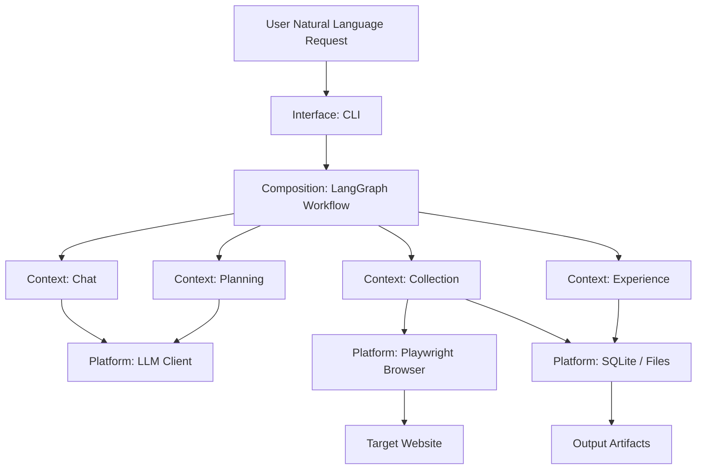
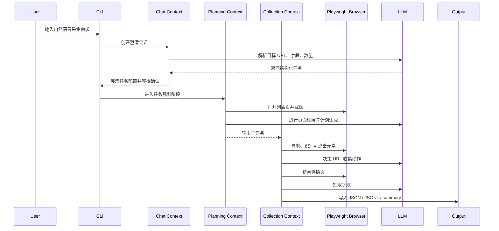
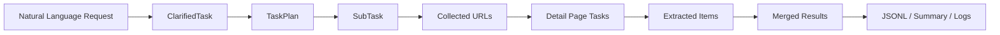
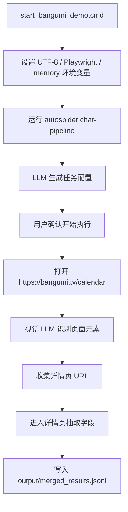

# 系统架构说明

## 1. 总体设计

AutoSpider 是一个面向网页数据采集任务的纯视觉浏览器智能体。用户通过自然语言描述采集目标，系统使用 LLM 将需求转化为结构化任务，并通过 LangGraph 编排多阶段 Agent 流程，最终由 Playwright 控制浏览器访问真实网页，完成 URL 收集、详情页字段抽取和结果落盘。

本项目采用轻量 DDD 分层组织代码，核心源码位于 `src/autospider-project/src/autospider/`。整体结构分为接口层、编排层、领域上下文层和平台基础设施层。



## 2. 目录与模块职责

```text
src/autospider-project/src/autospider/
├── interface/cli/       # Typer CLI 入口，负责参数解析、用户交互和运行结果展示
├── composition/         # LangGraph 工作流、流水线编排、跨上下文协调
├── contexts/
│   ├── chat/            # 任务澄清：将自然语言需求转为结构化采集任务
│   ├── planning/        # 任务规划：生成页面采集计划和子任务
│   ├── collection/      # 采集执行：导航、URL 收集、详情页字段抽取
│   └── experience/      # 经验沉淀：Skill、XPath、历史任务复用
├── platform/            # LLM、浏览器、日志、存储、配置等基础设施
└── prompts/             # LLM 提示词模板
```

### interface

接口层提供 CLI 命令，例如 `chat-pipeline`、`resume`、`doctor`、`benchmark`。课程演示主要使用两个 Windows 启动脚本：

- `start_bangumi_demo.cmd`：固定 Bangumi 演示任务，便于课堂展示。
- `start_autospider.cmd`：交互式输入采集需求。

### composition

编排层负责把各个上下文串成完整 Agent 流程。它主要处理：

- LangGraph 图构建与节点路由。
- pipeline 执行请求构造。
- 子任务调度和结果聚合。
- graph checkpoint 和 resume。
- failure / recovery 状态转换。

### contexts

领域上下文层承载核心业务逻辑：

- `chat`：识别用户意图、抽取列表页 URL、字段定义、目标数量等。
- `planning`：分析页面，生成任务计划、子任务、执行 brief。
- `collection`：使用浏览器执行导航、URL 收集、详情页字段抽取。
- `experience`：沉淀可复用的采集经验，例如 XPath 规则和 Skill 候选。

### platform

平台层提供跨模块基础能力：

- LLM client：OpenAI 兼容 API 调用。
- browser：Playwright 页面控制、截图、Set-of-Mark 标注。
- persistence：SQLite、文件输出、Redis 适配。
- observability：运行日志、trace id、run id。
- config：环境变量和运行参数读取。

## 3. Agent 执行流程

系统运行时将一次采集任务拆成多个阶段，每个阶段由不同上下文或工具完成。



## 4. 数据流设计



核心数据产物：

- `ClarifiedTask`：结构化任务，包含目标 URL、字段定义、目标数量、最大翻页数等。
- `TaskPlan`：任务计划，描述子任务列表和执行策略。
- `collected_urls.json`：列表页采集到的详情页 URL 和点击记录。
- `pipeline_extracted_items.jsonl`：单个子任务抽取到的结构化数据。
- `merged_results.jsonl`：最终合并结果。
- `pipeline_summary.json`：成功数、失败数、成功率、运行状态等摘要。
- `runtime.log`：完整运行日志。

## 5. 状态管理与记忆机制

项目使用 LangGraph 管理多阶段 Agent 状态，支持中断、恢复和 checkpoint。原项目主要依赖 Redis 保存图状态和队列状态；为了降低课程演示部署门槛，本项目增加了 memory 模式：

- `GRAPH_CHECKPOINT_BACKEND=memory`：使用内存 checkpoint，避免本地必须启动 Redis。
- `PIPELINE_MODE=memory`：使用内存 URL channel，支持单机小规模 Demo。
- `LOCAL_SERIAL_MODE=true`：本地串行执行，降低并发和外部依赖复杂度。

这套配置适合课程展示场景。Redis 适配代码仍保留，后续可恢复为 Redis 模式，用于更大规模或多 worker 的采集任务。

## 6. 工具调用设计

系统主要工具是 Playwright 浏览器工具和 LLM 推理工具。

### 浏览器工具

Playwright 用于：

- 打开目标网页。
- 等待页面加载。
- 获取页面截图。
- 标注可交互元素。
- 点击链接或按钮。
- 访问详情页。

### LLM 工具

LLM 用于：

- 需求澄清与字段定义。
- 页面视觉理解。
- 导航动作决策。
- URL 候选识别。
- 详情页字段抽取。
- 任务计划生成和失败恢复判断。

### 输出工具

文件系统用于保存运行产物：

```text
output/
├── merged_results.jsonl
├── task_plan.json
├── plan_knowledge.md
├── runtime.log
└── subtask_leaf_001/
    ├── collected_urls.json
    ├── pipeline_extracted_items.jsonl
    └── pipeline_summary.json
```

## 7. Bangumi Demo 流程

课程演示脚本为 `src/autospider-project/start_bangumi_demo.cmd`。它使用 memory 模式运行，默认任务为从 Bangumi 每日放送页面采集动画条目。



当前 Demo 控制在小规模采集，目标数量为 5 条。实际产出数量会受页面结构、LLM 视觉识别稳定性和网络状态影响，通常用于展示完整 Agent 流程，而不是大规模生产爬取。

## 8. 可观测性与评估入口

系统保留了多类可观测信息：

- CLI 输出：展示阶段进度、任务配置、成功/失败摘要。
- `runtime.log`：记录 LLM 请求、导航、采集、抽取和错误信息。
- `pipeline_summary.json`：记录采集成功率和终止状态。
- `task_plan.json`：记录规划阶段的子任务结构。
- `collected_urls.json`：记录 URL 收集过程和点击元素信息。

这些产物可用于后续 `docs/evaluation.md` 和最终报告中的测试评估章节。

## 9. 当前架构特点与局限

### 特点

- 以视觉理解为核心，不强依赖预先编写网页 XPath。
- 使用 LangGraph 管理多阶段 Agent 状态。
- 通过 Playwright 对真实网页进行端到端操作。
- 支持 memory 模式，便于本地演示。
- 输出产物完整，便于复盘和评估。

### 局限

- 视觉 LLM 调用成本较高，运行时间受网络和模型响应速度影响。
- 页面元素识别存在波动，目标数量较大时成功率可能下降。
- 当前没有 Web 前端，主要通过 CLI 和输出文件展示。
- memory 模式适合小规模演示，不适合大规模并发采集。

## 10. 后续扩展方向

- 增加 Web 前端，用于展示运行状态、日志和采集结果。
- 增强 XPath / Skill 复用能力，提高同类页面的稳定性。
- 增加 Redis / PostgreSQL 部署说明，支持多 worker 生产模式。
- 增加 benchmark 数据集，对比不同模型和参数下的成功率。
- 增加更细粒度的 LLM tracing，用于分析 token 成本和失败原因。
